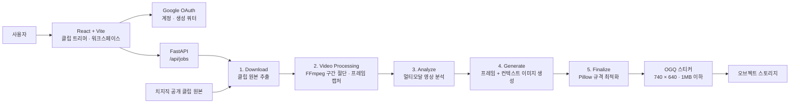

<div align="center">

# CLIPCON BETA


치지직 클립 링크 하나로 AI가 가장 인상적인 순간을 찾아  
네이버 OGQ 규격의 스트리머 스티커로 만들어주는 크리에이터 도구


</div>

---

## 소개

기존 AI 캐릭터 생성 도구는 얼굴, 머리 모양, 의상과 같은 **외형의 닮음**에 집중합니다.

하지만 스트리머 굿즈에서 팬들이 원하는 것은 단순히 닮은 그림이 아닙니다. 유행어, 말투, 표정의 타이밍, 웃음과 비명, 특유의 행동까지 포함한 **그 사람다움**입니다.

> **외형의 닮음 ≠ 캐릭터성의 닮음**

CLIPCON은 사람이 영상의 특징을 프롬프트로 설명하는 과정을 없애고, 멀티모달 AI가 영상과 소리를 직접 분석하도록 설계했습니다.

---

## 주요 기능

- 치지직 클립 URL 입력
- 원하는 5초 구간 직접 선택
- 영상과 소리를 함께 사용하는 멀티모달 분석
- 감정이 가장 강하게 드러나는 순간 자동 탐색
- 감정, 표정, 동작, 구도 및 유행어 추출
- 두 가지 이미지 생성 스타일 지원
- 원본 프레임을 활용한 외형 일관성 유지
- 네이버 OGQ 규격 자동 최적화
- Google OAuth 로그인 및 사용자별 생성 쿼터
- 분석 완료 후 업로드 영상 삭제

---

## 생성 스타일

| 모드 | 설명 |
| --- | --- |
| **캐릭터로 재창작** | 인물의 특징을 유지하면서 스티커 캐릭터 스타일로 새롭게 표현합니다. |
| **원본에 가깝게** | 실제 인물의 생김새와 당시 표정을 최대한 유지합니다. |

---

## 서비스 흐름

### 1. 링크 및 구간 선택

치지직 클립 URL을 입력하고 스티커로 만들고 싶은 5초 구간을 선택합니다.

```text
segment.mp4
reference.png
```

### 2. 스타일 선택

`캐릭터로 재창작` 또는 `원본에 가깝게` 모드를 선택합니다.

```text
mode = character
mode = original
```

### 3. 멀티모달 분석

영상과 소리를 함께 분석해 결정적인 순간과 캐릭터 컨텍스트를 구조화된 데이터로 추출합니다.

```json
{
  "bestTimestamp": 2.4,
  "emotion": "폭소",
  "imagePrompt": "고개를 뒤로 젖히고 크게 웃는 동작과 표정",
  "caption": "유행어 원문"
}
```

### 4. 이미지 생성

분석 결과와 해당 순간의 원본 프레임을 이미지 생성 모델에 함께 전달합니다.

```text
sticker_raw.png
1024 × 1024
```

### 5. OGQ 규격 최적화

이미지 비율을 유지하면서 OGQ 스티커 규격에 맞추고, 파일 크기를 자동으로 압축합니다.

```text
sticker_01.png
740 × 640px
PNG
1MB 이하
```

---

## 핵심 설계

### 외형은 프레임이, 표현은 컨텍스트가

CLIPCON은 **외형**과 **표현**을 서로 분리해 이미지 생성 모델에 전달합니다.

| 입력 | 역할 |
| --- | --- |
| 원본 프레임 | 얼굴, 머리 모양, 의상, 조명 등 외형의 기준점 |
| `emotion` | 해당 순간의 핵심 감정 |
| `imagePrompt` | 표정, 동작, 자세, 구도 등 표현의 방향 |
| `caption` | 이미지에 들어갈 유행어 원문 |

하나의 프롬프트에 외형과 화풍, 감정, 배경, 글자를 모두 넣으면 서로 충돌하는 지시가 발생할 수 있습니다.

CLIPCON은 원본 프레임이 외형을 담당하고, 구조화된 컨텍스트가 표현을 담당하도록 역할을 분리했습니다.

### 유행어는 별도 필드로 보존

유행어를 자유 서술형 프롬프트에 섞으면 정확한 문구를 구분하기 어렵습니다.

따라서 `caption` 필드로 분리해 원문을 그대로 보존합니다. 문구가 지나치게 길거나 적합하지 않은 경우에는 감정 표현으로 대체합니다.

### 클립 제목은 생성 단계에서 제외

클립 제목은 분석 단계의 참고 정보로만 사용합니다.

이미지 생성 단계에 제목을 다시 전달하면 제목 문자열이 이미지에 의도치 않게 그려질 수 있기 때문에 생성 프롬프트에서는 제외합니다.

---

## 왜 정지 프레임이 아닌 영상을 분석하나요?

입을 크게 벌리고 눈을 감은 한 장면은 다음과 같이 여러 의미로 해석될 수 있습니다.

- 크게 웃는 순간
- 하품하는 순간
- 비명을 지르는 순간

정지 프레임만으로는 이를 정확히 구분하기 어렵습니다.

CLIPCON은 영상과 오디오를 같은 시간축에서 분석합니다. 표정과 몸짓뿐만 아니라 웃음, 한숨, 비명, 호흡과 같은 비언어적 소리까지 함께 사용해 해당 순간의 감정을 판단합니다.

또한 게임 화면만 보고 승리나 기쁨으로 단정하지 않고, 화면보다 인물의 실제 표정과 반응을 우선하도록 분석 프롬프트를 설계했습니다.

---

## 시스템 구성



각 파이프라인 단계는 파일 경로를 입력받고 새로운 파일 경로를 반환합니다. 이를 통해 특정 단계만 개별 실행하거나 결과를 직접 확인할 수 있습니다.

---

## 기술 스택

| 영역 | 기술 |
| --- | --- |
| Frontend | React, Vite |
| Authentication | Google OAuth |
| Backend | FastAPI |
| Video Processing | FFmpeg |
| Multimodal Analysis | Gemini Flash |
| Image Generation | GPT Image, `images.edit` |
| Image Processing | Pillow |
| Storage | Object Storage |
| Output | PNG, OGQ Sticker Specification |

---

## 안정적인 AI 파이프라인

### 고정된 응답 스키마

다음 단계에서 자유로운 문장이 아닌 정확한 필드를 사용할 수 있도록 AI 응답을 고정된 JSON 스키마로 제한합니다.

```python
_RESPONSE_SCHEMA = {
    "type": "OBJECT",
    "properties": {
        "bestTimestamp": {"type": "NUMBER"},
        "emotion": {"type": "STRING"},
        "imagePrompt": {"type": "STRING"},
        "caption": {"type": "STRING"},
    },
    "required": [
        "bestTimestamp",
        "emotion",
        "imagePrompt",
        "caption",
    ],
}
```

### 오류 처리

- `bestTimestamp`는 선택한 영상 구간 안으로 제한합니다.
- JSON 파싱 실패 또는 필드 누락 시 한 번 재시도합니다.
- 두 번째 시도도 실패하면 명확한 오류로 종료합니다.
- `caption`이 너무 길면 억지로 자르지 않고 감정 표현으로 대체합니다.
- 분석을 위해 업로드한 영상은 작업이 끝난 뒤 삭제합니다.
- 파일 정리 실패가 이미지 생성 결과에 영향을 주지 않도록 분리합니다.

---

## 5초 구간을 사용하는 이유

영상은 이미지나 텍스트보다 많은 입력 토큰을 사용합니다. 분석 구간이 길어질수록 처리 시간과 API 비용도 함께 증가합니다.

CLIPCON은 분석 구간을 5초로 제한해 다음 요소의 균형을 맞췄습니다.

- 사용자가 원하는 순간을 쉽게 선택할 수 있는 UX
- 영상 분석에 필요한 충분한 시간적 맥락
- 빠른 응답 속도
- 예측 가능한 API 사용 비용
- 결정적인 표정과 소리의 정확한 연결

---

## OGQ 출력 규격

현재 MVP는 정지형 PNG 스티커 한 장을 생성합니다.

| 항목 | 현재 출력 |
| --- | --- |
| 파일 형식 | PNG |
| 이미지 크기 | 740 × 640px |
| 색상 모드 | RGB |
| 파일 용량 | 1MB 이하 |
| 크기 조절 | 원본 비율 유지 |
| 배치 | 캔버스 중앙 배치 |
| 업스케일 | 적용하지 않음 |

이미지 생성 모델이 정사각형 이미지를 반환하더라도 강제로 자르지 않습니다. 원본 비율을 유지한 채 축소해 740 × 640 캔버스 중앙에 배치합니다.

파일이 1MB를 초과하면 PNG 압축 단계를 높여가며 다시 저장합니다.

### OGQ 전체 세트 규격

향후 세트 생성 기능에서는 다음 규격을 지원할 예정입니다.

| 파일 | 규격 | 수량 |
| --- | --- | --- |
| 스티커 이미지 | PNG 또는 GIF · 740 × 640px | 24개 |
| 메인 이미지 | 240 × 240px | 1개 |
| 탭 이미지 | 96 × 74px | 1개 |
| 애니메이션 GIF | 최대 3초 · 100프레임 · 무한 반복 | 선택 |

---

## 현재 구현 상태

### NOW · MVP

- [x] 치지직 클립 링크 입력
- [x] 5초 구간 직접 선택
- [x] 원본 영상 구간 추출
- [x] 멀티모달 영상 및 오디오 분석
- [x] 구조화된 분석 결과 출력
- [x] 결정적인 순간 자동 선택
- [x] 캐릭터 재창작 모드
- [x] 원본에 가까운 모드
- [x] 정지형 PNG 스티커 한 장 생성
- [x] 740 × 640px 자동 최적화
- [x] 1MB 이하 자동 압축
- [x] Google OAuth 로그인
- [x] 사용자별 생성 쿼터

---

## 로드맵

### NEXT · 움직이는 스티커

- [ ] 최대 3초 GIF 스티커 생성
- [ ] 최대 100프레임 지원
- [ ] 자연스럽게 반복되는 구간 자동 선택
- [ ] 투명 배경 처리
- [ ] 배경 제거 후 가장자리 품질 개선

### LATER · 세트 단위 제작

- [ ] 한 클립에서 24종 스티커 세트 생성
- [ ] 감정 종류별 자동 배분
- [ ] 비슷한 표정의 반복 방지
- [ ] 메인 이미지 자동 생성
- [ ] 탭 이미지 자동 생성
- [ ] OGQ 업로드용 파일 일괄 패키징

---

## 팀

| 이름 | 역할 |
| --- | --- |
| 류승찬 | 팀장 |
| 이재환 | 프론트엔드 |
| 이준호 | 인프라 |

부산소프트웨어마이스터고등학교  
전국마이스터고 스타프로젝트 · IT · SW · 로봇

---

## 참고 자료

멀티모달 영상 압축과 분석 구조는 다음 공개 연구 자료를 참고했습니다.

- NVIDIA, **Nemotron 3 Nano Omni: Efficient and Open Multimodal Intelligence**
- arXiv:2604.24954
- 네이버 OGQ 크리에이터 스튜디오 공개 제작 가이드

---

## 유의 사항

다운로드한 스티커는 사용자가 네이버 OGQ 크리에이터 스튜디오에 직접 등록하고 심사를 요청해야 합니다. 승인 여부는 OGQ의 심사 기준에 따라 결정됩니다.

CLIPCON은 네이버, 치지직 또는 OGQ와 제휴하거나 공식적으로 운영되는 서비스가 아닙니다.

클립에 등장하는 인물과 콘텐츠의 권리를 확인한 뒤 사용해야 하며, 생성 결과물에 대한 책임은 사용자에게 있습니다.

---

<div align="center">

**그 순간의 캐릭터성을, 스티커로.**

CLIPCON은 건전하고 즐거운 스트리밍 문화를 만들어갑니다.

</div>
